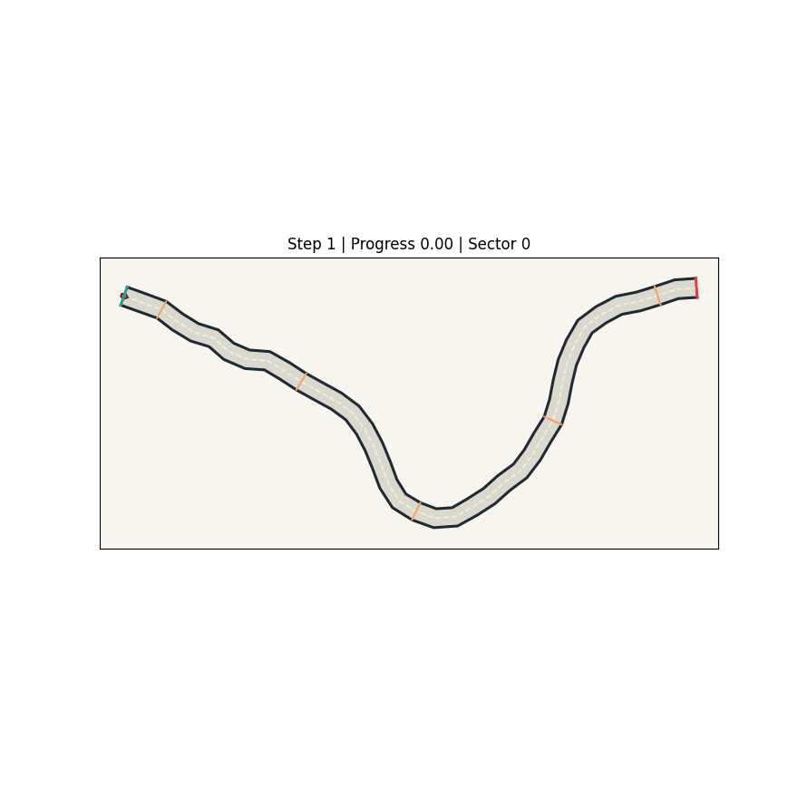
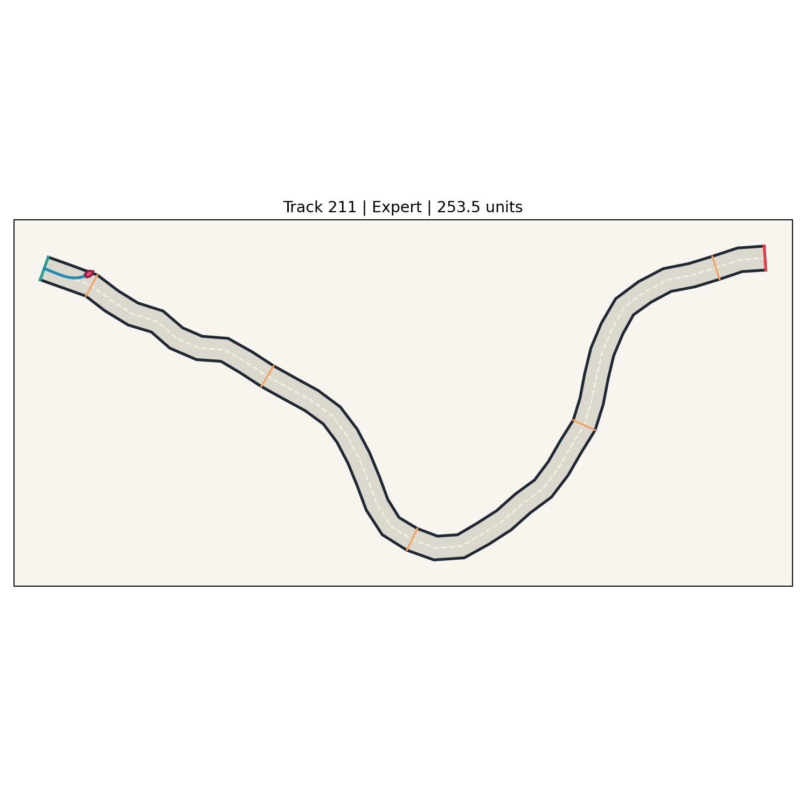

# EvoDrive Lab

EvoDrive Lab is a Docker-first Python playground for training and visualizing driving agents on procedurally generated 2D tracks.

It is built for two audiences at once:

- people who want a public GitHub project they can run and watch
- people who want a clean benchmark base for later research experiments



The current release focuses on a strong interactive MVP:

- a live `Simulation` tab where multiple cars attempt the same track together
- generation-by-generation `GA` training that visibly improves over time
- race-style course rendering with road surface, start/finish gates, and checkpoints
- saved `Replay` views for trained agents
- `FastAPI + Streamlit + worker` architecture that runs fully in Docker
- automatic PNG and GIF export from replay artifacts for GitHub-ready media



## Why This Project Is Interesting

Most AI driving demos either show one trained car or hide the training loop completely.

EvoDrive Lab makes the learning process visible:

- several cars start on the same track
- weaker policies crash early
- stronger policies go farther
- the course shows gates, sectors, and a clearer race context
- a new generation restarts from the back of the track
- over time, the population improves

That makes the project a better GitHub demo and a stronger foundation for future benchmark work.

## Current Features

- FastAPI backend for run creation and querying
- Streamlit frontend with `Simulation`, `Train`, `Replay`, `Benchmark`, and `Runs` tabs
- background worker that executes queued runs from SQLite
- deterministic procedural track generation
- Box2D-backed 2D driving environment with fallback movement logic
- ray sensors, progress rewards, crash detection, and replay export
- longer track presets for more challenging simulation runs
- custom genetic algorithm runner
- `neat-python` integration
- lightweight CPU-friendly PPO-style baseline
- report export to CSV and PNG

## Demo Flow

The best way to try the project is:

1. Start the app with Docker
2. Open the `Simulation` tab
3. Press `Start Simulation`
4. Watch 3 or more cars drive on the same track
5. Refresh automatically as each new generation is produced
6. Open the `Replay` tab to inspect saved single-agent runs

## Quickstart

### Requirements

- Docker
- Docker Compose

### Run Locally

```bash
git clone <your-repo-url>
cd evodrive_lab
docker compose up --build
```

Open:

- UI: [http://localhost:8501](http://localhost:8501)
- API docs: [http://localhost:8000/docs](http://localhost:8000/docs)

### Useful Commands

```bash
make up
make down
make restart
make build
make test
make lint
make typecheck
make smoke
make train-ga
make train-neat
make train-ppo
make benchmark
make demo-ga
```

## Architecture

```text
Streamlit UI ---> FastAPI ---> SQLite run registry <--- Worker
                                 |
                                 +--> run artifacts / reports / replays
                                 |
                                 +--> simulator + GA / NEAT / PPO runners
```

## Project Layout

- `app/api` - API routes and app bootstrap
- `app/web` - Streamlit frontend and replay rendering
- `app/worker` - polling worker and run dispatcher
- `app/simulator` - track generation, physics, sensors, and replay export
- `app/algorithms` - GA, NEAT, and PPO runners
- `app/storage` - SQLite models and repository helpers
- `app/benchmark` - evaluation helpers and track suites
- `tests` - unit and integration tests
- `runs` - runtime artifacts written by the app
- `reports` - exported CSV and chart artifacts

## Tech Stack

- Python 3.11
- FastAPI
- Streamlit
- SQLModel + SQLite
- NumPy
- Box2D
- Plotly
- pandas
- matplotlib animation
- Docker Compose

## What Is Ready Today

This release is suitable for:

- public GitHub publication as an MVP
- interactive demos
- early contributor feedback
- evolving the benchmark into a stronger research platform

## What Is Not Finished Yet

This is still an early public release, not a final research benchmark.

Still planned:

- more polished replay rendering
- richer benchmark comparison pages
- more rigorous multi-seed experiment scripts
- paper-quality figures and result tables

## Testing

The most reliable way to test the project is inside Docker:

```bash
make test
make lint
make typecheck
```

If you run tests directly on the host machine, you may need to install project dependencies locally first.

## Hardware Notes

- a 16 GB laptop is enough for development and light runs
- 32 GB RAM is better for smoother benchmarking
- PPO-heavy experiments benefit from stronger hardware, but the current baseline remains CPU-friendly

## Notes

- The current PPO path is intentionally lightweight so the Docker build stays practical on normal laptops.
- Runtime outputs in `runs/` and `reports/` are generated artifacts and should not be committed.
- The public-facing simulation experience is currently GA-first because that gives the clearest visible learning loop.

## Media Export

When a run exports a replay, EvoDrive Lab now also generates:

- a PNG course overview
- an animated GIF replay

These files are written into `reports/` and are meant to help you populate the README and GitHub project page.

## Contributing

See [CONTRIBUTING.md](CONTRIBUTING.md) for the local development workflow and current contribution priorities.

## License

This project is released under the [MIT License](LICENSE).
