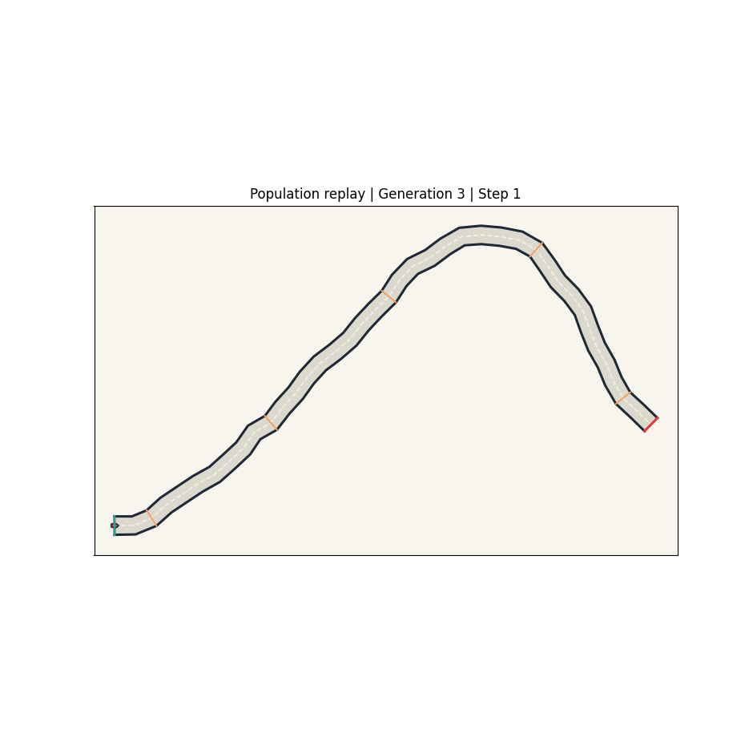
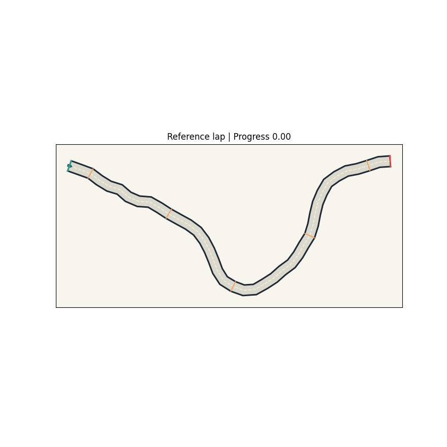

# EvoDrive Lab



EvoDrive Lab is a Python simulation project where AI cars learn to drive on procedurally generated 2D tracks. It combines a live multi-car demo, replay tools, and a Docker-first workflow so the project is easy to run, inspect, and extend.

## Highlights

- live eight-car population simulation
- procedurally generated race tracks
- genetic algorithm, NEAT, and PPO-style training paths
- replay export for GIFs and course snapshots
- FastAPI + Streamlit + worker architecture
- reproducible Docker setup for demos and experiments

## Overview

Each car receives observations from forward-facing sensors, chooses steering and throttle actions, and tries to survive long enough to make progress through the course.

Instead of hiding the learning process, this project makes it visible:

- multiple cars start on the same track
- weak policies crash or stall early
- stronger policies go farther
- a new generation starts and tries again
- over time, the population improves

That makes the project useful both as a visual demo and as a foundation for more serious experimentation.

## Why This Project Stands Out

Many driving AI demos only show a single trained agent after learning has already happened.

EvoDrive Lab focuses on the full loop:

- live population simulation
- replay inspection
- procedural track generation
- reproducible runs through Docker
- a codebase that can grow toward benchmark-quality experiments

If you want a project where people can immediately open the repo and understand what is happening, this is the point of the design.

## What You Can Do

- a `Simulation` tab where multiple cars drive on the same track together
- generation-by-generation `GA` learning that visibly changes behavior over time
- a `Replay` tab for saved single-run and population replays
- race-style rendering with start gate, finish gate, checkpoints, centerline, and walls
- run history, metrics, and exported media artifacts




## How It Works

At a high level, the system works like this:

1. The simulator generates a deterministic 2D track from a seed.
2. Cars observe the track through ray-style sensors and motion state.
3. A policy outputs steering and throttle.
4. The environment evaluates progress, crashes, and episode completion.
5. Training algorithms generate better policies over repeated runs.
6. Replays, charts, and GIFs are exported for inspection.

Right now, the clearest public-facing workflow is the genetic algorithm path, because it makes the improvement loop easy to watch in real time.

## Algorithms

- `GA`
  Custom genetic algorithm used for visible generation-by-generation learning
- `NEAT`
  Integrated through `neat-python`
- `PPO`
  Lightweight CPU-friendly baseline for comparison and future expansion

## Feature Set

- FastAPI backend for run creation and querying
- Streamlit frontend for simulation, replay, benchmark, and run browsing
- background worker for queued jobs
- SQLite-backed run tracking
- deterministic procedural track generation
- Box2D-based 2D driving environment with fallback motion logic
- sensor observations, progress rewards, crash detection, and replay export
- course overview PNG export
- population replay GIF export
- completed-lap GIF export
- Docker Compose workflow for local setup

## Quickstart

### Requirements

- Docker
- Docker Compose

### Run Locally

```bash
git clone https://github.com/bishaldan/evodrive-lab.git
cd evodrive-lab
docker compose up --build
```

Open:

- UI: [http://localhost:8501](http://localhost:8501)
- API docs: [http://localhost:8000/docs](http://localhost:8000/docs)

### Best First Run

1. Start the stack with Docker.
2. Open the `Simulation` tab.
3. Start a run and watch several cars try the same course together.
4. Open the `Replay` tab to inspect saved results.
5. Use the exported GIFs and PNGs in `reports/` for documentation or sharing.

### Useful Commands

```bash
make up
make down
make restart
make build
make test
make lint
make typecheck
make smoke
make train-ga
make train-neat
make train-ppo
make benchmark
make demo-ga
```

## Architecture

```text
Streamlit UI ---> FastAPI ---> SQLite run registry <--- Worker
                                 |
                                 +--> simulator + GA / NEAT / PPO runners
                                 |
                                 +--> run artifacts / reports / replays
```

## Repository Layout

- `app/api` - API routes and app bootstrap
- `app/web` - Streamlit frontend and replay rendering
- `app/worker` - queued run execution
- `app/simulator` - track generation, physics, sensors, and replay export
- `app/algorithms` - GA, NEAT, and PPO runners
- `app/storage` - SQLite models and repository helpers
- `app/benchmark` - evaluation helpers and track suites
- `tests` - unit and integration tests
- `runs` - runtime artifacts generated by the app
- `reports` - exported charts and media

## Tech Stack

- Python 3.11
- FastAPI
- Streamlit
- SQLModel + SQLite
- NumPy
- Box2D
- Plotly
- pandas
- matplotlib
- Docker Compose

## Good Fit For

This repo is a good fit if you want:

- a visual AI project for GitHub
- a simulation project that is easy to demo
- a base for future experimentation with neuroevolution and RL
- a reproducible local setup without complex manual installation

## Project Status

This is a strong public MVP, not a finished research benchmark.

What is already solid:

- the app runs in Docker
- the frontend is usable
- multi-car simulation and replay are working
- media export is working
- the project is good enough to publish and demo publicly

What is still planned:

- richer benchmark comparison pages
- a stronger research protocol for arXiv-style publication

What is already in place for the paper sprint:

- frozen paper experiment configs for the main comparison and two ablations
- a reproducible runner for `GA`, `NEAT`, and `numpy_ppo_lite`
- CSV and markdown aggregation outputs under `paper/results/`
- static matplotlib figure generation for paper-ready plots
- a first LaTeX manuscript scaffold under `paper/latex/`

## Development Checks

The most reliable way to test the project is inside Docker:

```bash
make test
make lint
make typecheck
```

If you run checks directly on the host machine, you may need to install dependencies locally first.

## Hardware Notes

- a 16 GB laptop is enough for development and light runs
- 32 GB RAM is better for smoother benchmarking
- the current PPO path is intentionally lightweight so the project stays practical on normal laptops

## Media Export

When a run exports replay data, EvoDrive Lab can also generate:

- a course overview PNG
- a population replay GIF
- a single-run replay GIF
- a completed-lap GIF

These artifacts are written into `reports/` and can be reused in the README, release notes, social posts, or future paper drafts.

## Paper Workflow

EvoDrive Lab now includes a paper workspace under `paper/` for running the benchmark matrix, aggregating results, generating figures, and drafting the manuscript.

Core commands:

```bash
make paper-queue-full
docker compose exec api python -m app.paper_tools.report aggregate-all
docker compose exec api python -m app.paper_tools.plots build-all
python -m app.paper_tools.latex
```

The current paper framing is intentionally modest: a small procedural 2D driving benchmark that compares `GA`, `NEAT`, and a lightweight PPO-style baseline on unseen tracks.

## Contributing

See [CONTRIBUTING.md](CONTRIBUTING.md) for the local workflow and contribution priorities.

## License

This project is released under the [MIT License](LICENSE).
